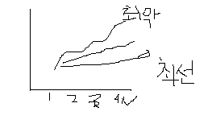

# Numpy array와 Python list 차이

출처 : https://bearwoong.tistory.com/60

## 1. 연산

```markdown
# 1. numpy array는 numpy array끼리 연산이 가능하지만 Python list는 덧셈만 가능하다.
# numpy 경우
[10, 5, 3, 7, 1, 5] + [10, 5, 3, 7, 1, 5] = [20, 10, 6, 14, 2, 10]
# list 경우
[10, 5, 3, 7, 1, 5] + [10, 5, 3, 7, 1, 5] = [10, 5, 3, 7, 1, 5, 10, 5, 3, 7, 1, 5] 

같은 맥락으로 numpy array는 numpy array 끼리 뺄셈, 곱셈, 나눗셈이 가능하다. 같은 인덱스에 있는 값들끼리 연산해준다. Pythom list는 리스트끼리 뺄셈, 곱셈, 나눗셈을 하면 오류가 난다.
```


```
# 2.  numpy array는 array 전체에 연산이 가능하지만 Python list는 곱셈만 가능하다.

# numpy array 경우 
 [10, 5, 3, 7, 1, 5] + 5 = [15, 10, 8, 12, 6, 10]

# list 경우
 [10, 5, 3, 7, 1, 5] * 2 = [10, 5, 3, 7, 1, 5, 10, 5, 3, 7, 1, 5]
```


## 2. 성능차이

```markdown
- python list는 다양한 자료형이 저장가능 
- numpy array는 같은 자료형만 넣을 수 있다. 

numpy array가 python list에 비해 문법이 간단하고 성능이 뛰어나다.
예를들어 1억개의 요소가 있는 기본 python list에 곱하기 2를 하려면 반복문을 1억번 돌려야 하는데 numpy array는 그냥 * 2 만 붙여주면 된다. 문법이 간단할 뿐만 아니라 실제 실행했을 때도 numpy array가 훨씬 짧은 시간에 연산을 마친다.

```


# 3. 빅오, 자료형

빅오(O, big-O)란 입력값이 무한대로 향할떄 함수의 상한을 설명하는 수학적 표기방법이다.




시간 또는 메모리를 분석하는 알고리즘의 복잡도를 계산할 때, 알고리즘 전체를 보지 않고 최악의 경우만을 살펴보는 것은 

# 결론

- python list는 값을 추가하고 제거에 사용,
- numpy array는 수치 계산이 많고 복잡할 때나 행렬같은 다차원 배열

상황에 맞게 사용하면 된다.


```markdown
pandas 의 DataFrame
python list나 numpy array와 비슷하게 pandas DataFrame 도 여러 값들을 저장할 때 쓰인다.
DateFrame 은 표형식의 데이터를 담기위한 자료형으로 2차원 numpy array에 부가적인 기능이 추가된 것이다. 
(DataFrame이 numpy array를 기반으로 만들어져 있어서 pandas를 쓰려면 numpy가 먼저 설치되어 있어야한다.)

예를들어 각 행과 열에 이름을 붙여줄 수 있어서 숫자인덱스가 아닌 정해준 이름으로 값을 찾을 수 있다. numpy array에서는 숫자 인덱스만 가능했다. 또 2차원 numpyarray에서는 모든 값이 같은 자료형이어야 하는 제약이 있었지만 DataFrame 에서는 다양한 자료형의 데이터를 담을 수 있다.
```

